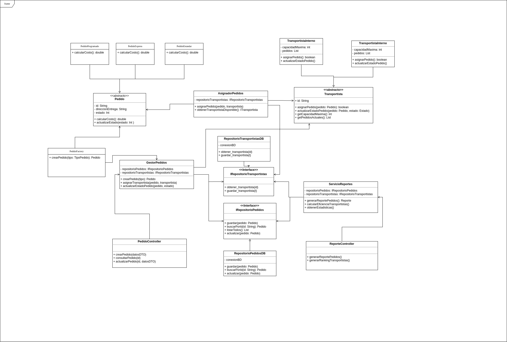

# Descripción general del diseño

## 1. Capas del Sistema

Se ha diseñado una arquitectura en capas para el **Sistema de Gestión de Entregas**, siguiendo una separacion de responsabilidades:

### Capa de Presentación (Interfaz de Usuario o API)

Es la capa encargada de recibir peticiones de los usuarios o clientes (como una aplicación web, una app móvil o una API REST).

#### Componentes principales:

- `PedidoController` → Maneja las solicitudes relacionadas con pedidos.
- `ReporteController` → Genera reportes de pedidos y transportistas.

### Capa de Aplicación (Servicios o Casos de Uso)

Contiene la lógica de negocio de alto nivel, Orquesta la ejecución de operaciones sin manejar directamente datos o lógica de persistencia.

#### Componentes principales:

- `GestorPedidos` → Lógica de negocio para crear y gestionar pedidos.
- `AsignadorPedidos` → Se encarga de asignar pedidos a transportistas disponibles.
- `ServicioReportes` → Genera reportes basados en datos del sistema.

### Capa de Dominio:

Contiene las entidades centrales del negocio y su comportamiento

#### Componentes principales:

- `Pedido` (Abstracto) Define la estructura común para todos los tipos de pedidos. Proporciona un método abstracto para calcular el costo según el tipo.
  - `PedidoEstandar`, `PedidoExpress`, `PedidoProgramado` Implementan el cálculo específico del costo para cada tipo de envío.
- `Transportista` (Abstracto) Define la estructura común para todos los transportistas.
  - `TransportistaInterno`, `TransportistaExterno` Implementan el comportamiento específico según el tipo de transportista.
- `PedidoFactory` (Crea instancias de pedidos) Facilita la creación de diferentes tipos de pedidos.

### Capa de Infraestructura

Maneja la interacción con la base de datos y servicios externos.

#### Componentes principales:

- `IRepositorioPedidos` (Interfaz) Define operaciones CRUD para pedidos.
- `RepositorioPedidosDB` (Implementación con base de datos) Implementa la persistencia en base de datos.
- `IRepositorioTransportistas` (Interfaz) Define operaciones CRUD para transportistas.
- `RepositorioTransportistasDB` (Manejo de transportistas en BD) Implementa la persistencia en base de datos.

---
## 2. Aplicación de los Principios SOLID

### 1. Principio de Responsabilidad Única (SRP)

- `Pedido`: Se enfoca únicamente en representar un pedido y su estado.
- `Transportista`: Se enfoca en gestionar la asignación y actualización de pedidos.
- `GestorPedidos`: Coordina operaciones con pedidos sin implementar directamente la persistencia.
- `PedidoController`: Gestiona las solicitudes del usuario sin contener lógica de negocio.
- `RepositorioPedidosDB`: Se encarga exclusivamente de la persistencia de datos.
- `RepositorioTransportistasDB`: Se encarga exclusivamente de la persistencia de datos.

Cada clase tiene una única razón para cambiar, cumpliendo así con el SRP.

### 2. Principio Abierto/Cerrado (OCP)

- La clase abstracta `Pedido` permite crear nuevos tipos de pedidos (Estándar, Express, Programado) sin modificar el código existente.
- La clase abstracta `Transportista` permite agregar nuevos tipos de transportistas sin alterar el sistema.
- `PedidoFactory` facilita la creación de diferentes tipos de pedidos sin modificar el cliente.
- La interfaz `IRepositorioPedidos` permite implementar diferentes mecanismos de persistencia sin cambiar la lógica de negocio.
- La interfaz `IRepositorioTransportistas` permite implementar diferentes mecanismos de persistencia sin cambiar la lógica de negocio.

### 3. Principio de Sustitución de Liskov (LSP)

- Las subclases de `Pedido` (PedidoEstandar, PedidoExpress, PedidoProgramado) pueden utilizarse donde se espera un objeto de tipo Pedido.
- Las implementaciones de `IRepositorioPedidos` pueden reemplazarse sin afectar el funcionamiento del sistema.
- Las implementaciones de `IRepositorioTransportistas` pueden reemplazarse sin afectar el funcionamiento del sistema.

### 4. Principio de Segregación de Interfaces (ISP)

- La interfaz `IRepositorioPedidos` incluye únicamente operaciones relacionadas con la persistencia de pedidos.
- La interfaz `IRepositorioTransportistas` incluye únicamente operaciones relacionadas con la persistencia de transportistas.

### 5. Principio de Inversión de Dependencias (DIP)

- `GestorPedidos` depende de la abstracción `IRepositorioPedidos`, no de implementaciones concretas.
- El sistema utiliza `PedidoFactory` para crear instancias concretas de pedidos.
- `ServicioReportes` depende de `IRepositorioPedidos`, no de una implementación específica.
- Los controladores dependen de servicios abstractos, no de implementaciones concretas.

---
## 3. Aplicación de los Principios GRASP

### 1. Experto en Información (Information Expert)

- `Pedido` conoce su propio estado y cómo calcular su costo.
- `Transportista` sabe cómo asignar y actualizar pedidos dentro de su capacidad.
- `AsignadorPedidos` tiene el conocimiento para determinar qué transportista es adecuado para un pedido.

### 2. Creador (Creator)

- `PedidoFactory` es responsable de crear diferentes tipos de pedidos.
- `GestorPedidos` coordina la creación y asignación de pedidos utilizando la fábrica.

### 3. Controlador (Controller)

- `PedidoController` y `ReporteController` actúan como intermediarios entre la interfaz de usuario y la lógica de negocio.
- Estos controladores no implementan lógica de negocio, solo coordinan solicitudes.

### 4. Bajo Acoplamiento (Low Coupling)

- El uso de interfaces (`IRepositorioPedidos`, `IRepositorioTransportistas`) reduce el acoplamiento entre componentes.
- La estructura en capas minimiza las dependencias entre módulos.
- El patrón Fábrica (`PedidoFactory`) reduce el acoplamiento entre el cliente y las clases concretas.

### 5. Alta Cohesión (High Cohesion)

- Cada clase tiene un propósito bien definido y enfocado.
- `GestorPedidos` coordina operaciones con pedidos.
- `AsignadorPedidos` se enfoca exclusivamente en asignar pedidos a transportistas.
- `ServicioReportes` se especializa en generar reportes.

### 6. Polimorfismo (Polymorphism)

- Las diferentes implementaciones de `Pedido` calculan su costo de manera específica.
- La interfaz `IRepositorioPedidos` permite diferentes implementaciones de persistencia.
- La interfaz `IRepositorioTransportistas` permite diferentes implementaciones de persistencia.

### 7. Fabricación Pura (Pure Fabrication)

- `AsignadorPedidos` no representa una entidad del dominio, pero proporciona una funcionalidad cohesiva.
- `ServicioReportes` es una fabricación pura que encapsula la lógica de generación de reportes.
- `PedidoFactory` es una fabricación pura que encapsula la lógica de creación.

### 8. Indirección (Indirection)

- `GestorPedidos` proporciona indirección entre la capa de presentación y el dominio.
- `IRepositorioPedidos` introduce indirección entre la lógica de negocio y la persistencia.
- `IRepositorioTransportistas` introduce indirección entre la lógica de negocio y la persistencia.

### 9. Variaciones Protegidas (Protected Variations)

- Las interfaz `IRepositorioPedidos` protegen contra cambios en implementaciones.
- La clase abstracta `Pedido` protege contra variaciones en los tipos de pedidos.

---
## 4. Flujo de Interacción

**Creación de un Pedido:**

- El usuario interactúa con la interfaz web y envía un formulario de creación de pedido.
- **PedidoController** recibe la solicitud HTTP.
- **PedidoController** invoca al **GestorPedidos**.
- **GestorPedidos** utiliza **PedidoFactory** para crear el pedido del tipo adecuado.
- **GestorPedidos** guarda el pedido usando **IRepositorioPedidos**.

**Asignación de un Pedido a un Transportista:**

- **PedidoController** recibe una solicitud de asignación.
- **PedidoController** invoca al **GestorPedidos**.
- **GestorPedidos** utiliza **AsignadorPedidos**.
- **AsignadorPedidos** obtiene transportistas disponibles de **IRepositorioTransportistas**.
- **AsignadorPedidos** selecciona el mejor transportista y le asigna el pedido.

**Actualización del Estado de un Pedido:**

- El transportista actualiza el estado de un pedido desde su aplicación.
- **PedidoController** recibe la solicitud.
- **GestorPedidos** verifica que el transportista esté autorizado.
- Se actualiza el estado del pedido.
- **RepositorioPedidosDB** almacena el cambio.

**Generación de Reportes:**

- Un administrador solicita un informe de eficiencia.
- **ReporteController** recibe la solicitud.
- **ServicioReportes** consulta datos de **IRepositorioPedidos** e **IRepositorioTransportistas**.
- **ServicioReportes** procesa y genera el reporte.
- **ReporteController** devuelve los datos formateados.